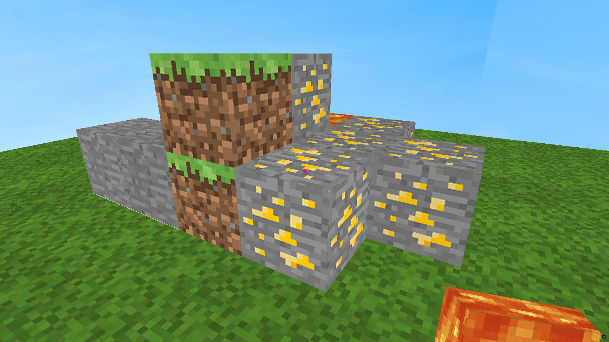

# MineCraft Clone with Ursina 👋

`minecraft clone` is able to show you that `Ursina` makes yours coding life more exciting.

## ✨ Demo



## 🚀 Usage

```
git clone https://github.com/yoonhero/minecraft_clone
```

And Install PiP Requirements

```{python}
pip install -r requirements.txt
```

Run And Edit Code!! Make your World!

```
python3 main.py 
```